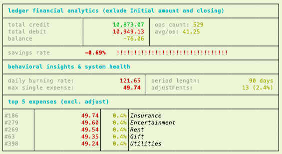

# 📔 Codexi CLI

**A high-integrity, anchor-based personal financial ledger built in Rust.**
> 🌐 [codexi.ethal.fr](https://codexi.ethal.fr)

     [](https://github.com/ethal/codexi-project/releases)



---

## 📔 Description

Codexi is a command-line personal finance ledger focused on auditability, traceability, and long-term data integrity. It supports multiple accounts, anchor-based integrity checks, period closing with archival, and a rich analytics dashboard — all stored in a versioned, checksummed binary format.

## 🧠 Design Philosophy

Codexi does not prevent financial states — it documents them.
Negative balances, large adjustments, and corrections are allowed by design. Integrity is enforced through explicit operations and full auditability, never by silent constraints.

---

## ✨ Features

- **Multi-Account** — manage several accounts, switch active account at any time
- **Anchor-Based Integrity** — operation dates validated against history anchors (`INIT`, `CLOSE`, `ADJUST`)
- **Period Closing & Archival** — formally close periods into `.cld` archive files with a carried-forward balance
- **Financial Analytics Dashboard** — savings rate, daily burn rate, top expenses, system health
- **HTML Statement Export** — rendered report openable directly in your browser
- **Multi-format I/O** — export and import via JSON, TOML, or CSV
- **Snapshot & Backup** — lightweight snapshots for quick rollback, full ZIP backups including archives
- **Exact Arithmetic** — fixed-point decimal (`rust_decimal`), no floating-point errors
- **Explicit Void Semantics** — operations are never deleted; voids create compensating entries
- **Versioned Storage (V3)** — CBOR with magic header, versioning, and checksum

---

## 🚀 Installation

**Prerequisites:** Rust 1.85+ ([rustup.rs](https://rustup.rs))

```bash
git clone https://github.com/ethal/codexi-project.git
cd codexi-project
cargo build --release
./target/release/codexi-cli --help
```

---

## 📖 Typical Workflow

```bash
# 1. Initialize a new account
codexi account create 2025-01-01 My Bank Account --type Current
codexi history init 2025-01-01 1500.00

# 2. Record daily operations
codexi credit 2025-01-05 2400.00 Monthly salary
codexi debit  2025-01-06 45.00  Groceries

# 3. Consult and analyze
codexi search
codexi report balance
codexi report stats --from 2025-01-01 --to 2025-01-31

# 4. Protect your data before risky operations
codexi data snapshot create
codexi data import json

# 5. Close a period at year end
codexi history close 2025-12-31 Closing Year 2025
codexi admin backup
```

---

## 🗂️ Command Reference

### Core
| Command | Description |
| :--- | :--- |
| `credit <date> <amount> [desc]` | Record an incoming flow |
| `debit <date> <amount> [desc]` | Record an outgoing flow |
| `transfer <date> <amount_from> <amount_to> <account_id_to> [desc]` | Record transfer from current account to other account |
| `search(view) [--from] [--to] [--text] [--kind] [--flow] [--min-amount] [--max-amount] [--latest]` | Search and filter operations |

### Account
| Command | Description |
| :--- | :--- |
| `account list` | List all accounts (`*` = active, `c` = closed) |
| `account create <date> <name> [--type]` | Create a new account |
| `account use <id>` | Switch active account |
| `account close <id> <date>` | Close an account |
| `account rename <id> <name>` | Rename an account |
| `account context` | view the context of the current account |
| `account set-bank <bank id>` | set bank to current account |
| `account set-currency <currency id>` | set currency to current account |
| `account set-context [--overdraft] [--balance-min] [--max-monthly-transactions] [--deposit-locked-until] [--interest] [--signers]` | set context to current account |

### Bank
| Command | Description |
| :--- | :--- |
| `bank list` | List all the bank available |

### Currency
| Command | Description |
| :--- | :--- |
| `currency list` | List all the currency available |

### Category
| Command | Description |
| :--- | :--- |
| `category list` | List all the category available |

### Report
| Command | Description |
| :--- | :--- |
| `report balance [--from] [--to]` | Debit / credit / balance summary |
| `report stats [--from] [--to] [--net]` | Full analytics dashboard |
| `report summary` | Quick overview of the current account |
| `report statement [--from] [--to] [--open]` | Export an HTML statement |

### History
| Command | Description |
| :--- | :--- |
| `history init <date> <amount>` | Initialize ledger with a starting balance |
| `history adjust <date> <amount>` | Adjust balance to a physical amount |
| `history void <id>` | Void an operation (creates a compensating entry) |
| `history close <date> [desc]` | Close a period and archive transactions |
| `history archive` | Manage the archived file |

| Command | Description |
| :--- | :--- |
| `history archive list` | List archive files (`.cld`) |
| `history archive view <account_id> <date>` | View the content of an archive file |

### Data
| Command | Description |
| :--- | :--- |
| `data export <json\|toml\|csv>` | Export active ledger |
| `data import <json\|toml\|csv>` | Import into active ledger |
| `data snapshot` | Manage the snapshot of the active ledger |

| Command | Description |
| :--- | :--- |
| `data snapshot create` | Lightweight snapshot of the active ledger |
| `data snapshot list` | List available snapshots |
| `data snapshot restore <filename>` | Restore from a snapshot |
| `data snapshot clean [--keep N]` | Remove old snapshots (keeps 5 by default) |

### Maintenance
| Command | Description |
| :--- | :--- |
| `admin backup [--target-dir]` | Full ZIP backup (ledger + archives) |
| `admin restore <filename>` | Restore from a ZIP backup |
| `admin migrate <version>` | Migrate ledger and archives to a new format version |
| `admin audit [--rebuild]` | Audit the current account and rebuild balance as per option |
| `admin clear-data` | ⚠️ Move ledger files to trash |
| `admin trash` | ⚠️ Manage the trash |
| `admin infos` | Display ledger metadata and storage info |
| `admin export-special` | Raw JSON export (no validation) |
| `admin import-special` | ⚠️ Raw JSON import (no validation) |
| `admin export-script` | Export current account operations in a script for a replay |

| Command | Description |
| :--- | :--- |
| `admin trash restore-trash <datetime>` | ⚠️ Restore from trash |
| `admin trash purge-trash` | ⚠️ Empty the trash directory |

---

## 📊 Analytics Dashboard (`report stats`)

- **Smart filtering** — `INIT` and `CLOSE` operations always excluded; `ADJUST` excluded from behavioral metrics
- **Void semantics** — by default, voided operations are excluded (historical view); use `--net` for net-impact view within a period
- **Savings Rate Bar** — dynamic indicator, turns to danger mode if expenses exceed income
- **Daily Burn Rate** — average daily spending over the selected period
- **System Health** — tracks adjustment ratio to monitor data quality

---

## 📂 Import / Export

Fixed filenames are used for simplicity:
- **Export** → creates `codexi.<ext>` in the current directory
- **Import** → expects `codexi.<ext>` in the current directory

> ⚠️ Always run `data snapshot` before an import.

JSON and TOML exports include an `export_version` field (currently **V2**) for forward compatibility. These formats are interchange-only and do not carry internal storage metadata.

---

## 🛡️ Data Safety Layers

```
[ Active Ledger ]  --snapshot-->  [ snapshots/ (.snp) ]
       |
  system close
       |
[ archives/ (.cld) ]  --system backup-->  [ backup.zip ]
```

---

## 🗃️ Data Location

| OS | Path |
| :--- | :--- |
| **Linux** | `~/.local/share/fr.ethal.codexi/` |
| **macOS** | `~/Library/Application Support/fr.ethal.codexi/` |
| **Windows**| `%AppData%\Roaming\fr.ethal.codexi\` |

Files: `codexi.dat` (active ledger) · `archives/` · `snapshots/` · `trash/`

---

## 🏗️ Project Structure

Codexi is organized as a **Cargo workspace** with two crates:

- **`crates/codexi`** — the core library: domain logic, storage, analytics, import/export. No CLI dependency.
- **`crates/codexi-cli`** — the command-line interface built on top of the library.

This separation keeps the business logic independently testable and reusable.

A companion **`www/`** directory contains the static website hosted at [codexi.ethal.fr](https://codexi.ethal.fr).

---

## 🧭 Versioning

| Layer | Version | Notes |
| :--- | :--- | :--- |
| Application (CLI) | `0.1.0` | Semantic versioning — active development |
| Core library | `0.1.0` | Semantic versioning — active development |
| Storage format | `V3` | CBOR, magic header, checksum |
| Export format (JSON/TOML/CSV) | `V2` | |

> **Note**: CLI versions `1.0.0` → `2.0.1` correspond to an earlier 
> single-binary architecture, kept as git tags for reference.

---

## 🤝 Contributing

Bug reports and pull requests are welcome via GitHub.

## 📄 License

MIT

## 📬 Author

**ethal** — [codexi@ethal.fr](mailto:codexi@ethal.fr)
